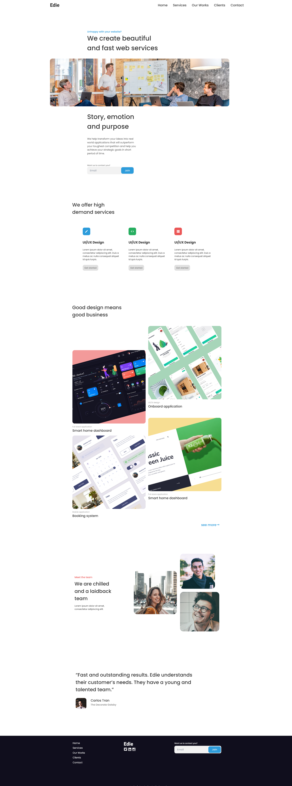
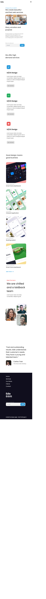

<h1 align="center">Edie Homepage</h1>

<div align="center">
   Solution for a challenge from  <a href="http://devchallenges.io" target="_blank">Devchallenges.io</a>.
</div>

<div align="center">
  <h3>
    <a href="https://eloquent-klepon-82cb42.netlify.app/">
      Demo
    </a>
    <span> | </span>
    <a href="https://devchallenges.io/challenges/xobQBuf8zWWmiYMIAZe0">
      Challenge
    </a>
  </h3>
</div>

## Table of Contents

- [Overview](#overview)
  - [Built With](#built-with)
- [How to use](#how-to-use)

## Overview




### Built With

- [Vite](https://vitejs.dev/)
- [Tailwind](https://tailwindcss.com/)

## How To Use

To clone and run this application, you'll need [Git](https://git-scm.com) and [Node.js](https://nodejs.org/en/download/) (which comes with [npm](http://npmjs.com)) installed on your computer. From your command line:

```bash
$ git clone https://github.com/furkan-kayis/edie-homepage

$ npm install

$ npm run dev
```
